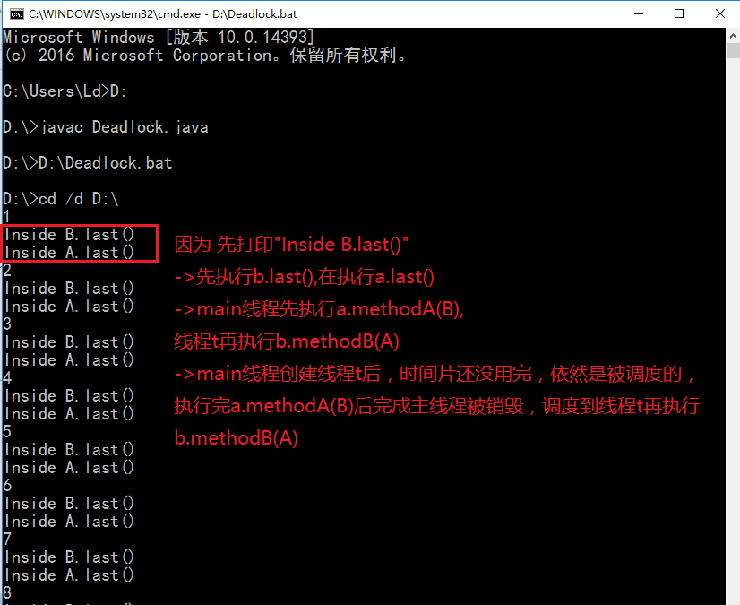
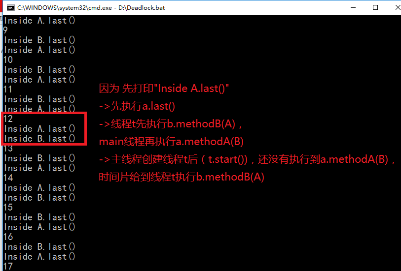
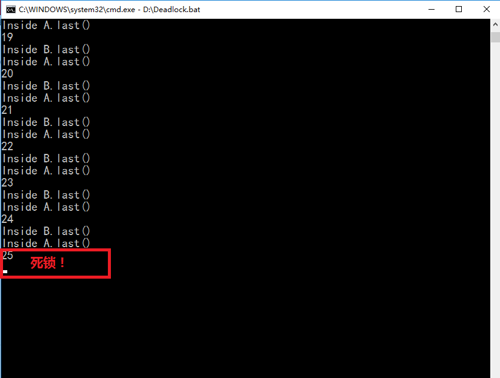
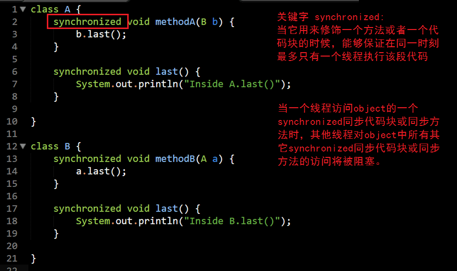
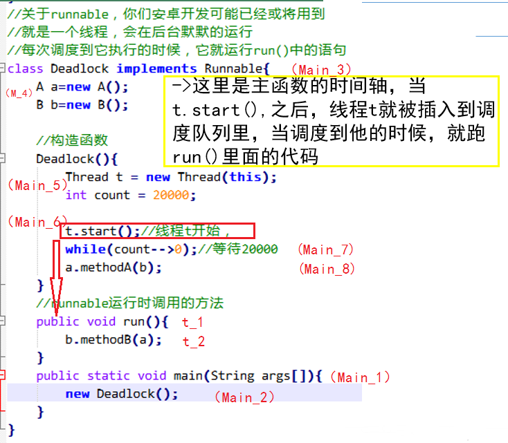
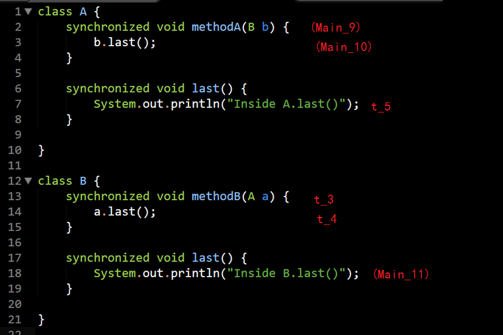

## 嵌入式系统导论实验报告
-------

|  姓名  |  学号  |  班级  |  电话  |  邮箱  |
| :--: | :--: | :--: | :--: | :--: |
|  林丹 | 15352204 | 1509 | 13609754376  | lindan113@163.com |

-----


### 1. 实验题目： 死锁

- 死锁停在第几次的截图
- 产生死锁的4个必要条件
- 对上述程序产生死锁的解释

### 2. 实验结果

#### 2.1 死锁停在第几次的截图

**截图与简要分析**



  
注*：分别展示了【不死锁情况1】【不死锁情况2】【死锁】三种情况。

#### 2.2 产生死锁的4个必要条件
**死锁就是两个或者多个进程，互相请求对方占有的资源。**
- 互斥条件：一个资源每次只能被一个进程使用；
- 请求与保持条件：一个进程因请求资源而阻塞时，对已获得的资源保持不放；
- 不剥夺条件:进程已获得的资源，在末使用完之前，不能强行剥夺；
- 循环等待条件:若干进程之间形成一种头尾相接的循环等待资源关系。

#### 2.3 对上述程序产生死锁的解释




一共有两个线程：main主线程，已经主线程中创建的线程t.

流程图如下：


----
##### 死锁产生的关键

当线程执行到下面这种情况：
```
主线程：
a.methodA(b)
-> b.last()

线程t:
b.methodB(a)
-> a.last()
```

主线程和线程t都执行分别到了methodA()和methodB()，但是这个时候：
主线程不能再调用b.last()，因为b.last()和methodB()是synchronized的，线程t已经占有了methodB()，所以**主线程被阻塞，等待线程t的b.methodB()完成**；

同理，
线程t也不能再调用a.last()，因为a.last()和methodA()是synchronized的，主线程已经占有了methodA()，所以**线程t被阻塞，等待主线程的a.methodA()完成**。

根据死锁的条件，两个线程占有资源又互相等待，所以死锁。

----------


### 3. 实验心得
使用markdown的好处在于不用去调格式，非常好用的标记语言;
重新复习了操作系统死锁的条件；


